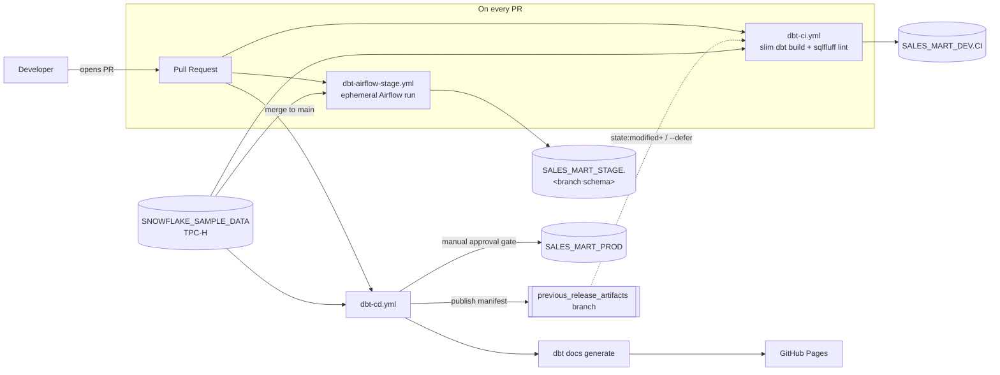
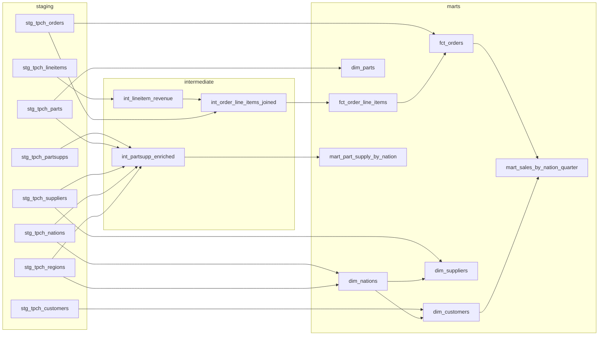
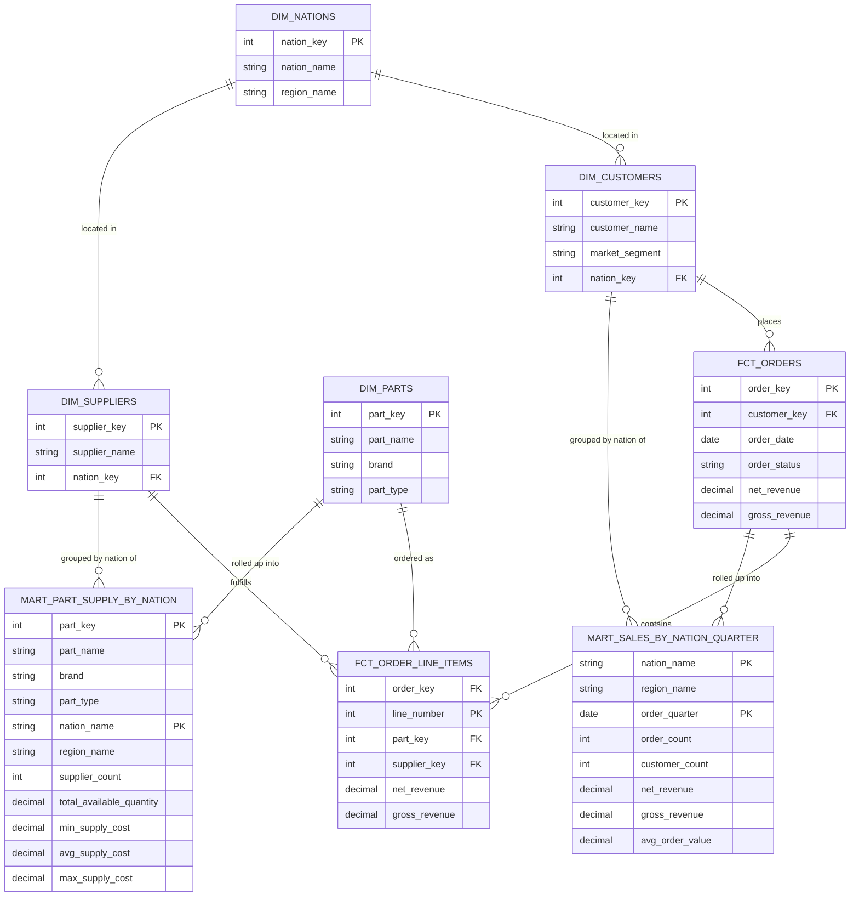

# Sales Analytics Mart Project

This is a dbt-core project that builds a sales analytics mart on Snowflake from the sample TPC-H dataset, with a full CI/CD pipeline and Airflow orchestration.

For step-by-step setup, pipeline configuration, and operational procedures, see the [**Runbook**](docs/RUNBOOK.md). For provisioning a brand-new Snowflake account, see [`snowflake/README.md`](snowflake/README.md).

## Overview

The project transforms TPC-H sample data (`SNOWFLAKE_SAMPLE_DATA`) into a sales mart of customers, suppliers, parts, orders, and pre-aggregated reporting tables — following dbt's standard staging → intermediate → marts layering. It ships with:

- A CI pipeline that slim-builds and lints every pull request
- A CD pipeline that deploys to production on merge, behind a manual approval gate, and publishes docs
- An ephemeral, per-PR Airflow (Astronomer/Cosmos) run that exercises the actual orchestration path, not just `dbt build`

## Tools & technologies

| Category | Tool |
|---|---|
| Transformation | [dbt-core](https://github.com/dbt-labs/dbt-core) + [dbt-snowflake](https://github.com/dbt-labs/dbt-snowflake) |
| Warehouse | [Snowflake](https://www.snowflake.com/) (separate `DEV` / `CI` / `STAGE` / `PROD` databases/schemas) |
| Orchestration | [Apache Airflow](https://airflow.apache.org/) via [Astronomer Astro CLI](https://www.astronomer.io/docs/astro/cli/overview) + [astronomer-cosmos](https://astronomer.github.io/astronomer-cosmos/) |
| CI/CD | [GitHub Actions](https://docs.github.com/actions) |
| Linting | [sqlfluff](https://sqlfluff.com/) (`dbt` templater) |
| Auth | Snowflake key-pair auth (CI/CD/stage service accounts), SSO/`externalbrowser` (local dev) |
| Package management | dbt packages via [`dependencies.yml`](dbt_sales_mart/dependencies.yml) (`dbt_utils`) |

## Process followed

1. **Model layering** — raw TPC-H tables are staged 1:1 (`stg_tpch_*`), reshaped/enriched in an intermediate layer, and exposed as dimension/fact/aggregate tables in `marts`. Downstream layers only ever `ref()` the layer directly below them.
2. **Environment isolation** — every stage of the pipeline writes to its own Snowflake database or schema (dev, per-PR CI schema, per-PR stage database, production), each behind its own least-privilege service account.
3. **Change-scoped CI** — pull requests only rebuild changed models and their downstream dependents (slim CI via `state:modified+`), deferring unbuilt refs to production data.
4. **Gated promotion** — merges to `main` require a manual approval before touching production, after which docs are published automatically.
5. **Orchestration parity** — the same Cosmos-based Airflow DAG that would run in production is exercised against an isolated schema on every PR, so orchestration issues surface before merge, not after.

## High-level design (HLD)

## Low-level design (LLD): dbt model DAG

## Entity-relationship diagram (ERD)

The mart layer forms a standard star schema around orders and order line items:

`mart_sales_by_nation_quarter` and `mart_part_supply_by_nation` are pre-aggregated reporting tables derived from the star schema above — their "primary key" is really a grouping key (nation/quarter, part/nation), not a natural entity identifier, so treat their PK markers as grain rather than a true row identity.

## Repository layout

| Path | Purpose |
|---|---|
| [`dbt_sales_mart/`](dbt_sales_mart/) | The dbt project (models, tests, `dependencies.yml`, `profiles.yml`) |
| [`ci/`](ci/), [`cd/`](cd/) | Secrets-free dbt profiles used by the CI and CD workflows |
| [`.github/workflows/`](.github/workflows/) | `dbt-ci.yml`, `dbt-cd.yml`, `dbt-airflow-stage.yml` |
| [`airflow/`](airflow/) | Astro/Airflow project running the dbt project as a Cosmos DAG |
| [`snowflake/`](snowflake/) | One-time SQL to provision Snowflake objects for a new account/environment |
| [`scripts/`](scripts/) | Setup and CI helper scripts |
| [`docs/RUNBOOK.md`](docs/RUNBOOK.md) | Full setup and operational instructions |
